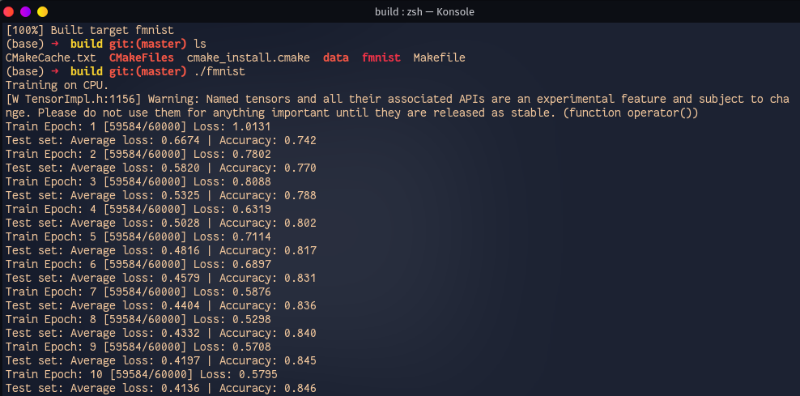

# PyTorch Deep Learning Models using the C++ frontend


## Gettting started 

Clone the repo 

```bash 
 1. https://github.com/mrdvince/pytorchcpp
 2. cd fashionmnist or folder interested in
```
Run:

```bash 
cmake -DCMAKE_PREFIX_PATH="/home/vince/libtorch" .. && cmake --build . --config Release
```
This should generate a release build using cmake

Finally execute the generated binary file.

```bash
./fmnist
```

## Screenshots



  
